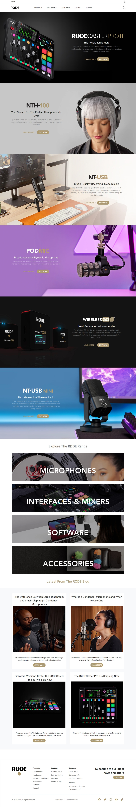

# Rode clone

Hi 👋 I am Shobhan Sundar Goutam. This project is made with the help of `HTML`, `CSS` and `Tailiwnd CSS`.

 

 

### Screenshot

- ### Learnings from this project:-

  - Learned to use Tailwind more accurately.
  - Learned to use the breakpoints more precisely for responsiveness of the website.

- It took around _14 hours_ to complete.

- Live Link:- [Rode clone](https://rode-clone-fsjs.netlify.app/)
